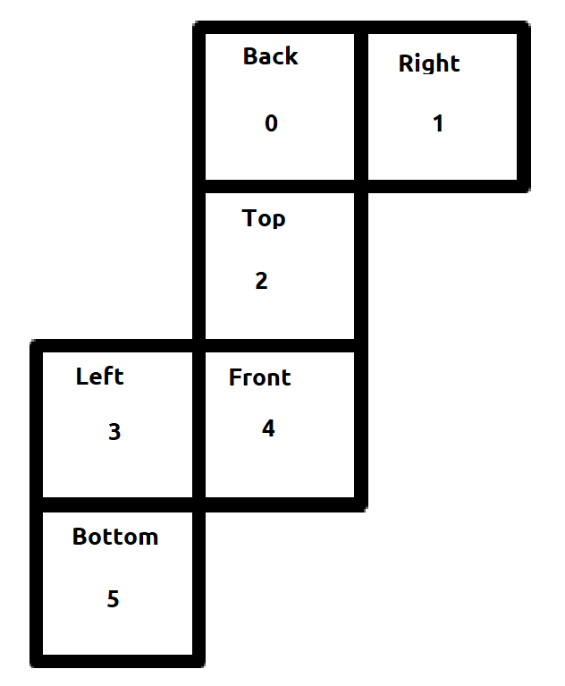
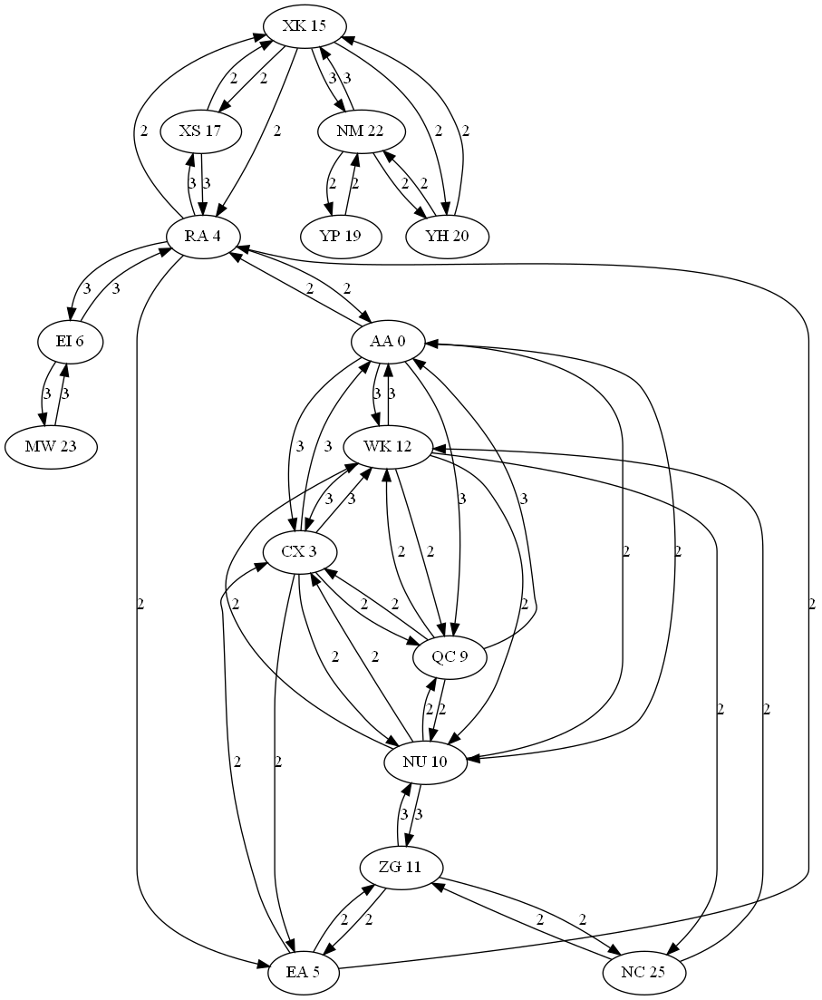

# Advent of Code 22

Solutions for the advent of code 2022 puzzles, implemented in Python. The
puzzles can be found here: https://adventofcode.com/2022

## Algorithms

### Cycle Detection

To detect a cycle:

1. Determine what the `state` is, i.e. the things needed to determine if a certain set of conditions
   has occurred before.
2. For each iteration check if the current `state` is in `visited` states.
3. If false, add current `state` to visited.
4. If true, cycle detected. If conditions from the previous time this `state` occurred are needed
   use a dict for `visited` where the keys are the `state` and the conditions are the keys.

See day 17 for an example.

### Circular Doubly Linked List

See algorithms.py for an example how how to create a circular double linked list.

### Cube

There is a method called "cube mapping" that uses the six faces of a cube as tiles. It is then
possible to convert between a `(x, y, z)` coordinate on the surface of the cube and a `(face, u, v)`
coordinate of a tile/face. See https://en.wikipedia.org/wiki/Cube_mapping for more details.



## Python

Iterate a list in groups of size `N`:

```
for group in (items[i:i + N] for i in range(0, len(items), N)):
    pass
```

Avoid `eval()` or at least use `ast.literal_eval()` instead.

collections.deque is a useful data structure. It has fast remove and insert at both ends and has
support for e.g. rotations.

## C++

For problems that requires speed Python may not cut it. C++ is a good option in these cases as it
fast and has some useful data structures and algorithms as part of the standard. Parsing the input
is however in many cases much easier in Python. An idea is to parse and preprocess the data in
Python and generate a C++ header file to include. The `fscanf()` function may be useful if one
decides to parse in C++. See day 16 for an example.

## DOT

The DOT language is useful for visualizing graphs. See day 16 for an example.



## Math

### Complex Numbers

It is useful to represent a 2D coordinate system using complex numbers. Translations can then
easily be performed with complex addition and rotation can be performed by complex multiplication.
To rotate clockwise multiply the coordinate/vector by `i`, to rotate counter clockwise multiply by
`-i`. See day 22 for an example.

### Modulo

Modulo plays nice with multiplication and addition, see modulo rules. This means that performing a
lot of additions and multiplications of a number then taking modulo `N` gives the same result as
performing modulo `N` after each operation. This can be helpful if the operations would create a
huge number and we are only interested of the modulo `N` of this number.

To keep track of a number `X` modulo any number in a set of numbers `{N1, N2, ..., Nn}` we can use
the same principle as above but use `N1*N2*...Nn` as `N` (or rather the least common multiple of the
`N`s). This means that by performing `X` modulo `N` after each operation, then performing `X`
modulo `Ni` will give the expected (correct) result.

### Rotate Matrix 45 Degrees

Rotating a square matrix 45 degrees can be done as follows:

```
M_rot[x - y][x + y] = M[y][x],
```

i.e.

```
x' = x + y
y' = x - y
```

To rotate back use the following equations:

```
x = (x' + y') // 2
y = (x' - y') // 2
```

Note that the rotated matrix will be translated, see
[this](https://math.stackexchange.com/questions/732679/how-to-rotate-a-matrix-by-45-degrees) for
more information.
